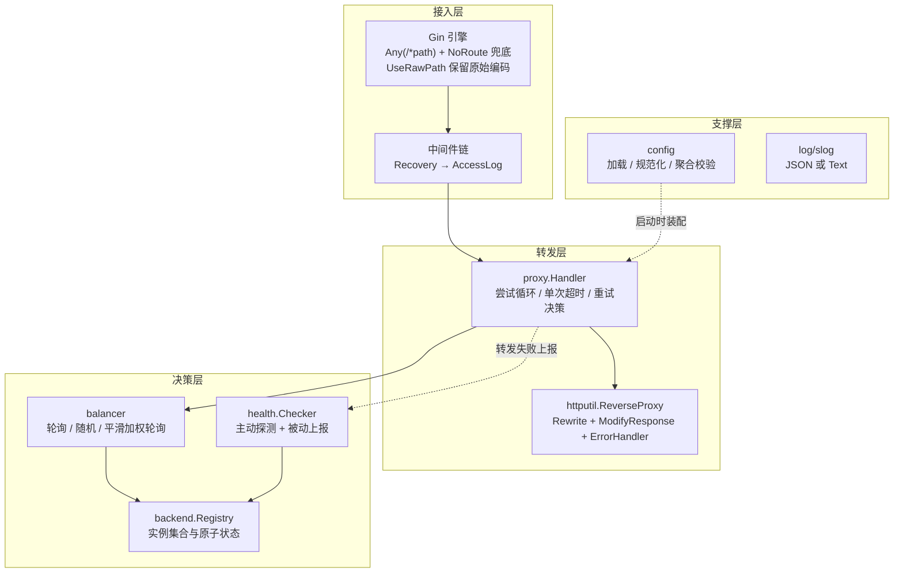
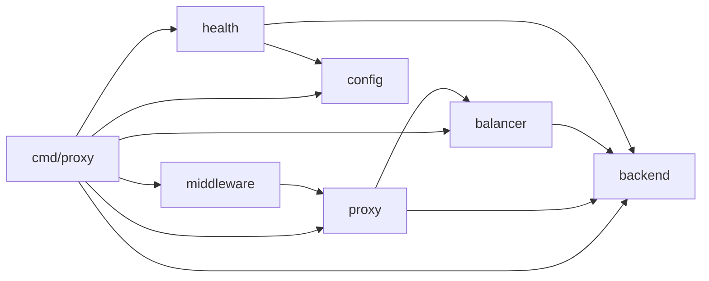
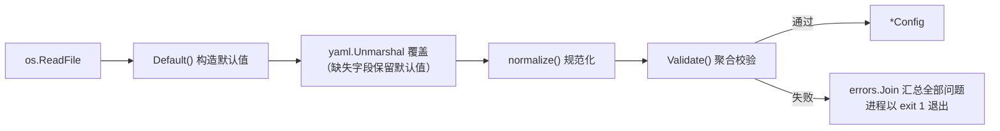
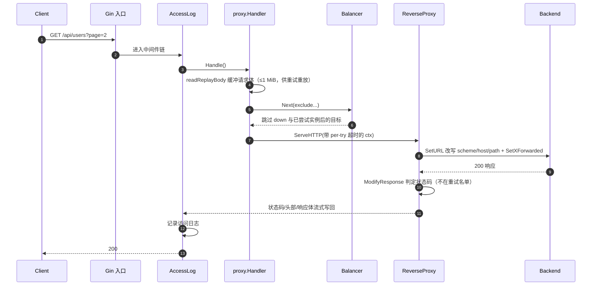
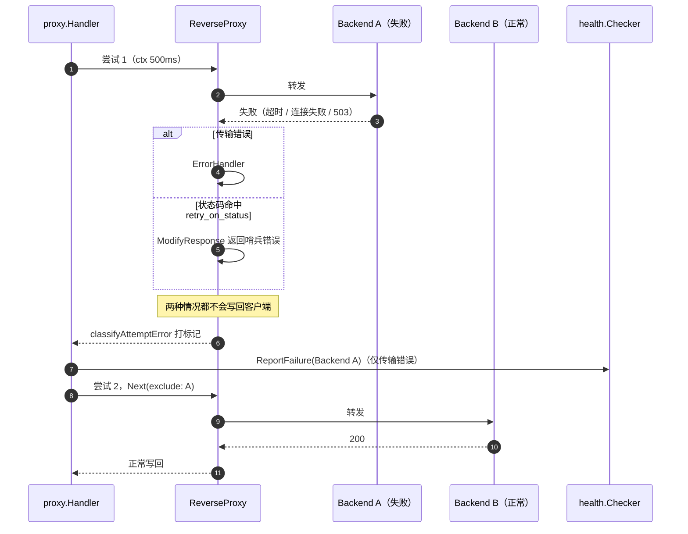
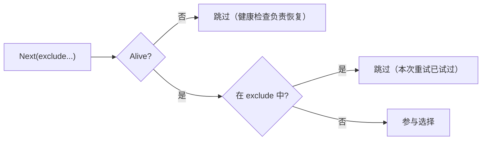
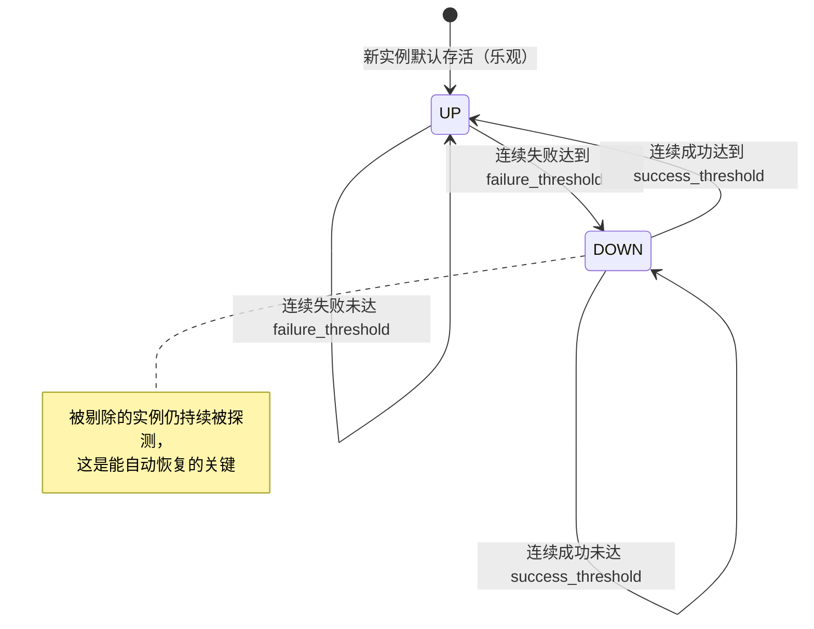

# 反向代理与负载均衡器 — 设计文档

> 对应题面第 8 条：说明架构、配置格式、转发流程、健康检查机制。
> 本文描述的是 **阶段 0–5 已实现并发测通过** 的全部功能（tag `v0.6.0-cli`）。
> 可选模块（限流、Docker）在末章「演进方向」中标注。

## 目录

1. [目标与范围](#一目标与范围)
2. [架构设计](#二架构设计)
3. [配置格式](#三配置格式)
4. [转发流程](#四转发流程)
5. [负载均衡](#五负载均衡)
6. [健康检查机制](#六健康检查机制)
7. [错误码与响应约定](#七错误码与响应约定)
8. [并发与资源管理](#八并发与资源管理)
9. [关键设计决策与取舍](#九关键设计决策与取舍)
10. [测试策略](#十测试策略)
11. [已知局限与演进方向](#十一已知局限与演进方向)

---

## 一、目标与范围

实现一个 HTTP 反向代理与负载均衡器，满足：

| # | 要求 | 实现位置 |
| --- | --- | --- |
| 1 | 监听端口接收客户端请求 | `cmd/proxy` + `gin.Engine` |
| 2 | 按配置转发到多个后端实例 | `internal/proxy` |
| 3 | ≥2 种负载均衡策略 | `internal/balancer`（3 种） |
| 4 | 健康检查，自动剔除与恢复 | `internal/health` |
| 5 | 请求超时、重试、访问日志 | `internal/proxy` + `internal/middleware` |
| 6 | CLI / 配置文件启动 | `internal/config` + `cmd/proxy/cli.go` |
| 7 | 单元测试覆盖核心逻辑 | 各包 `*_test.go` |
| 8 | 设计文档 | 本文 |

**明确不做**：动态路由规则、请求改写插件、TLS 终止、Web 管理界面（除已约定的限流与 Docker 外）。

## 二、架构设计

### 2.1 分层与职责



### 2.2 包依赖关系



依赖是单向无环的。两个刻意的设计：

- **`proxy` 不依赖 `config`**：转发参数通过 `proxy.Options` 传入，配置结构变化不会波及转发内核，也让 `proxy` 可以脱离本项目复用；
- **`middleware` 依赖 `proxy`**（仅为读取 `proxy.CtxKeyUpstream` 常量），反向不存在。

### 2.3 模块职责

| 包 | 职责 | 关键类型 |
| --- | --- | --- |
| `internal/config` | YAML 加载、默认值填充、规范化、聚合校验 | `Config`、`Duration` |
| `internal/backend` | 后端实例模型（URL/权重/存活状态/统计）与注册表 | `Backend`、`Registry`、`Stats` |
| `internal/balancer` | 三种负载均衡策略，支持排除已尝试实例 | `Balancer`、`roundRobin`、`random`、`weightedRoundRobin` |
| `internal/health` | 主动定时探测 + 被动失败上报，阈值防抖地维护存活状态 | `Checker` |
| `internal/proxy` | 转发内核：逐请求选实例、单次超时、换实例重试、错误回写 | `Handler`、`Options`、`attemptState` |
| `internal/middleware` | 访问日志（Gin 中间件） | `AccessLog` |
| `cmd/proxy` | 入口：命令行解析、依赖装配、监听与优雅退出 | `options`、`run` |

## 三、配置格式

### 3.1 完整字段表

| 字段 | 类型 | 默认值 | 说明 |
| --- | --- | --- | --- |
| `listen` | string | `:8080` | 监听地址，不能为空 |
| `strategy` | string | `round-robin` | `round-robin` / `random` / `weighted-round-robin` |
| `backends[]` | list | 无（必填 ≥1） | 后端实例列表 |
| `backends[].url` | string | 无 | 必须是 `http`/`https`，不可重复 |
| `backends[].weight` | int | `1` | ≤0 时自动归一为 1，仅加权策略使用 |
| `health_check.enabled` | bool | `true` | 关闭后**主动探测与被动剔除同时失效** |
| `health_check.path` | string | `/healthz` | 自动补前导 `/`；后端带基础路径时追加在其后 |
| `health_check.interval` | duration | `5s` | 探测周期，必须 > 0 |
| `health_check.timeout` | duration | `2s` | 单次探测超时，必须 > 0 |
| `health_check.failure_threshold` | int | `3` | 连续失败达到该值即剔除，≥1 |
| `health_check.success_threshold` | int | `2` | 连续成功达到该值即恢复，≥1 |
| `retry.max_attempts` | int | `3` | 含首次请求的总尝试次数，≥1 |
| `retry.per_try_timeout` | duration | `3s` | 单次尝试超时，必须 > 0 |
| `retry.retry_on_status` | list | `[502,503,504]` | 命中即换实例重试，取值 100–599 |
| `retry.retry_non_idempotent` | bool | `false` | 是否允许非幂等方法完整重试 |
| `rate_limit.*` | - | 关闭 | 见第十一章（阶段 8 实现） |
| `logging.level` | string | `info` | `debug` / `info` / `warn` / `error` |
| `logging.format` | string | `json` | `json` / `text` |
| `logging.access_log` | bool | `true` | 是否输出访问日志 |
| `timeouts.read_header` | duration | `10s` | `http.Server` 读请求头超时，> 0 |
| `timeouts.write` | duration | `0` | 写超时，`0` 表示不限制（支持流式/SSE） |
| `timeouts.idle` | duration | `90s` | 空闲连接超时，> 0 |

### 3.2 duration 写法

统一使用 `config.Duration` 自定义类型：

| 写法 | 含义 |
| --- | --- |
| `"500ms"` / `"3s"` / `"1m"` / `"1m30s"` | 标准 Go duration 写法 |
| `"5"` | 纯数字按**秒**解释 |
| `""` | 视为 `0` |
| `"3 秒"` | 报错：`无法解析时长` |

### 3.3 加载流程



**规范化（自动容错，不报错）**：

- 字符串字段 trim 并转小写（策略、日志级别/格式、限流域）；
- `weight <= 0` 归一为 `1`；
- 后端 URL 去尾部斜杠；
- 健康检查路径补前导 `/`。

**校验（聚合报错）**：用 `errors.Join` 一次性列出**全部**问题，而不是遇到第一个就返回，便于一次改完配置。覆盖策略白名单、后端 URL scheme/host/重复、时长合法性、阈值下界、状态码范围等 14 类非法输入。

注意区分两类错误：**YAML 语法/类型错误**在反序列化阶段就会中断（只报首个）；**语义校验**才是聚合报错。

## 四、转发流程

### 4.1 正常路径



关键点：

1. **保留原始 URL 编码**：Gin 侧 `UseRawPath = true` + `UnescapePathValues = false`，`SetURL` 内部沿用 `RawPath`，因此 `/files/a%2Fb/c.txt` 不会被二次解码成 `/files/a/b/c.txt`（有专门用例守护）。
2. **请求头安全**：使用 `Rewrite`（Go 1.20+）而非 `Director`，标准库会先丢弃客户端伪造的 `X-Forwarded-*`，再由 `SetXForwarded` 写入可信值。
3. **成功响应不缓冲**：状态码与头部一经判定无需重试，就立即写回客户端，响应体直接流式透传（`FlushInterval = 100ms`，`text/event-stream` 由标准库另行处理）。

### 4.2 失败与重试路径



### 4.3 重试决策

重试需要同时满足「还有剩余尝试次数」与「该请求允许重试」：

| 失败类型 | 幂等方法<br/>(GET/HEAD/PUT/DELETE/OPTIONS/TRACE) | 非幂等方法<br/>(POST/PATCH/…) |
| --- | --- | --- |
| 连接建立失败（dial 失败） | 重试 | **重试**（请求肯定没被后端处理） |
| 超时 / 连接中断 | 重试 | 不重试 |
| 命中 `retry_on_status` | 重试 | 不重试 |

补充规则：

- `retry_non_idempotent: true` 后，非幂等方法按上表**完整**重试；
- 请求体先被缓冲（≤1 MiB）以便重放；**超过上限**的请求体原样流式转发，但该请求不再重试；
- 重试会**排除已尝试过的实例**（`Balancer.Next(exclude...)`）。因此**只配置一个后端时不会重试**——与 nginx `proxy_next_upstream` 行为一致；
- 无更多实例可尝试时，用最后一次失败的原因回写。

## 五、负载均衡

### 5.1 策略对比

| 策略 | 适用场景 | 实现要点 |
| --- | --- | --- |
| `round-robin` | 实例规格一致 | 原子计数器取模 + 定位第 n 个可用实例 |
| `random` | 实例数多、想避免同步效应 | 随机下标 + 定位第 n 个可用实例 |
| `weighted-round-robin` | 实例规格不一致 | nginx 同款**平滑**加权轮询 |

### 5.2 零分配且公平的取值方式

轮询与随机都采用**两趟遍历**：先统计「既存活又未被排除」的实例数 `n`，再取模 / 随机得到 `k`，最后定位第 `k` 个可用实例。

这样做而不是「先过滤出健康列表再取模」的原因是：

- **零分配**：不需要每次请求构造健康实例切片（加权策略另行加锁，见下）；
- **公平**：按*可用*实例数取模，某个实例下线时，剩余实例之间**依然严格轮流/均分**。若按全量下标取模再线性探测，3 个实例挂 1 个会退化成 1/3 : 2/3。

### 5.3 平滑加权轮询

每个存活实例维护一个 `current` 权重，每轮：全部 `current += weight`，选出最大值，让其 `current -= 总权重`。与「朴素加权轮询（连续打同一实例 N 次）」相比能打散请求，避免瞬时集中。

权重 3:1 的状态推演：

| 轮次 | 累加后 current | 选中 | 减去总权重后 | 结果 |
| --- | --- | --- | --- | --- |
| 1 | [3, 1] | A | [-1, 1] | A |
| 2 | [2, 2] | A | [-2, 2] | A |
| 3 | [1, 3] | B | [1, -1] | B |
| 4 | [4, 0] | A | [0, 0] | A |

序列为 `A A B A` 循环（每 4 次 3:1），而不是 `A A A B`。

被剔除的实例 `current` 归零（恢复后从零重新累计）；被**临时排除**（重试跳过）的实例不累加也不清零，保留轮询进度。

### 5.4 实例状态与选路的关系



## 六、健康检查机制

### 6.1 两条通道

| 通道 | 触发方式 | 判定 |
| --- | --- | --- |
| **主动** | 每 `interval` 请求一次 `{backend}{health_path}` | **仅 2xx 视为健康**；不跟随重定向（关心该路径本身的响应码）；超时按失败计 |
| **被动** | 转发出现**传输层错误**时由 `proxy` 上报 `ReportFailure` | 立即计入连续失败，无需等下一个探测周期（更灵敏） |

两者共用同一套「连续失败 / 连续成功」计数，因此探测成功会**清零**被动累计的失败次数。响应状态码异常（如 503）不计入被动失败——那说明实例是可达的，交给主动探测判定该路径的健康度。

### 6.2 状态机与阈值防抖



- 只有**连续**达标才切换，可避免网络抖动导致实例反复剔除/恢复（服务震荡）；
- 状态用 `atomic.Bool`，翻转时才打一条日志（`SetAlive` 的返回值保证只打印一次），便于直接 grep 剔除/恢复事件；
- 新实例默认乐观存活，但 `Run` 启动时会**立即探测一次**，避免首个周期内所有实例都处于乐观状态。

### 6.3 客户端断开不算后端故障

转发失败时先区分原因：

- `errors.Is(err, context.Canceled) && !DeadlineExceeded` → 客户端主动断开：只记 Debug 日志，**不回写响应、不计入失败统计**（否则会误伤健康后端）；
- `errors.Is(err, context.DeadlineExceeded)` → 自己的 `per_try_timeout` 触发：算后端故障，可重试，最终回写 504。

## 七、错误码与响应约定

| 场景 | 状态码 | 响应体 |
| --- | --- | --- |
| 无任何存活实例 | `503` | `{"error":"no healthy backend","total_backends":N}` |
| 单次尝试超时 | `504` | `{"error":"gateway timeout","upstream":"..."}` |
| 连接失败等其余转发错误 | `502` | `{"error":"bad gateway","upstream":"..."}` |
| 各种尝试均失败且是状态码触发 | `502` | `{"error":"bad gateway","upstream":"...","last_status":503}` |
| 后端正常响应（含 4xx/5xx） | 原样透传 | 后端响应体 |
| 客户端断开 | 不回写 | - |

错误响应统一为 JSON（`application/json; charset=utf-8`），便于客户端与压测脚本解析。

## 八、并发与资源管理

| 关注点 | 做法 |
| --- | --- |
| 实例存活状态 | `atomic.Bool`，读无锁 |
| 实例统计计数 | `atomic.Int64`（请求数、失败数） |
| 轮询计数 | `atomic.Uint64` |
| 平滑加权轮询的 `current` | 互斥锁（需要多字段一致性，且临界区极短） |
| 健康检查的连续计数 | 互斥锁保护 `map[*Backend]*streak`；日志也在锁内打印，换取实现简单 |
| 实例集合 | 构造后不再变化，因此无需锁；`All()` 返回快照副本防止外部改写 |
| 健康检查并发探测 | 每轮对每个实例起 goroutine + `WaitGroup`，一轮内并行 |
| 连接池 | `MaxIdleConns=256`、`MaxIdleConnsPerHost=64`、`IdleConnTimeout=90s`、`DialTimeout=5s`、`TLSHandshakeTimeout=5s` |
| 优雅退出 | `signal.NotifyContext` 捕获 SIGINT/SIGTERM → 取消健康检查 → `srv.Shutdown`（最长 10s） |

所有测试都在 `-race` 下运行，其中包含专门构造的并发场景（并发选路 + 并发切换存活状态、并发探测 + 并发上报）。

## 九、关键设计决策与取舍

### 9.1 用 Gin 做入口，但转发内核是标准库

Gin 只承担路由与中间件（`Any("/*path")` + `NoRoute` 兜底），转发交给 `httputil.ReverseProxy`。理由：

- 反向代理需要处理 WebSocket 升级、流式响应、`Trailer` 等，标准库实现经过充分验证；
- Gin 的 `responseWriter` 已实现 `Hijacker` / `Flusher`，两者可以无缝衔接；
- 自带 `Recovery` 中间件防止单请求 panic 拖垮进程。

> 踩坑记录：gin v1.12 的 `responseWriter.CloseNotify()` 会对底层 writer 做强制类型断言，而 `ReverseProxy` 在请求 context 无取消信号时会探测该接口，因此**单元测试里直接传 `httptest.ResponseRecorder` 会 panic**。测试中用自定义 recorder 补上 `CloseNotify` 解决，生产环境不受影响。

### 9.2 重试决策点放在「响应写回客户端之前」

候选方案对比：

| 方案 | 结论 |
| --- | --- |
| 缓冲整个响应体，判定后再决定 | ❌ 大响应/SSE 会被内存吃满，流式特性丢失 |
| 用 `lazyWriter` 在 `WriteHeader` 处拦截 | ⚠️ 可行，但需要自造 writer 并处理 header 隔离 |
| **在 `ModifyResponse` 返回哨兵错误**（最终采用） | ✅ 天然处于「已拿到响应、尚未写回」的位置，失败响应本就会被 `ReverseProxy` 关闭丢弃，无需自造 writer |

再配合 `Balancer.Next(exclude...)` 排除已尝试实例，"客户端只会收到一次响应" 这条不变量就有了保证。

### 9.3 幂等性保护优先于"重试更多"

默认只对幂等方法做完整重试，非幂等方法仅允许在**连接建立阶段**失败时重试（用 `*net.OpError.Op == "dial"` 精确判定，而不是笼统地"按方法一刀切"）。这样既能救回大部分网络抖动，又不会在"请求可能已被后端处理"时重复提交。

### 9.4 只做最小 CLI，不复制配置字段

题面要求是「CLI **或** 配置文件」。若把 YAML 字段全部做成 flag，会造成：配置两个来源（需定义优先级）、校验逻辑写两遍、文档与测试面翻倍。因此 CLI 只保留配置文件表达不了的能力：

| 参数 | 不可替代性 |
| --- | --- |
| `-config` | 配置文件本身得先被定位（多环境） |
| `-check` | 是**动作**而非设置项（CI / 上线前自检） |
| `-version` | 同样是动作（确认线上跑的是哪个构建） |
| `-listen` | 部署时覆盖（容器里改文件不便） |

## 十、测试策略

| 对象 | 方法 |
| --- | --- |
| 配置 | 表驱动覆盖默认值继承、规范化、时长解析、14 类非法配置、文件缺失 |
| 后端实例 | 权重/URL 归一化、副本语义、存活翻转、统计、并发读写 |
| 均衡策略 | 确定性序列断言（随机策略注入可替换的下标选择器）、下线/排除后的分布、并发安全、并发状态切换 |
| 健康检查 | 阈值剔除与恢复、探测路径与状态码判定、超时、主动被动共用计数、禁用时空操作、`Run` 启停 |
| 转发内核 | 请求透传、编码路径、基础路径、转发头、502/503/504、重试与排除、幂等性、请求体重放、超大体不重试 |
| 访问日志 | 字段完整性、5xx 提升为 WARN、含引号查询串不破坏单行 JSON |
| CLI | 参数解析、帮助、版本、配置摘要、三种动作与错误路径 |

运行方式：

```bash
go test ./... -race      # 全量 + 竞态检测
go test ./... -cover     # 覆盖率
```

## 十一、已知局限与演进方向

| 局限 | 说明 |
| --- | --- |
| 后端列表静态 | 仅来自配置文件，不支持运行时增删；`Registry` 已按"构造后不变"设计，扩展时需要补锁 |
| 健康检查状态不持久 | 进程重启后所有实例回到乐观存活，靠首轮探测纠正 |
| 无分布式协调 | 多代理实例各自探测，不共享健康状态 |
| 限流未实现 | `rate_limit` 配置项已预留（阶段 8 落地：令牌桶，按 IP 或全局） |
| 未提供容器化 | Dockerfile / docker-compose 在阶段 8 |
| 无 TLS 终止 | 上游为 http/https 均可转发，但代理自身只提供 HTTP 监听 |

**演进方向**：限流（令牌桶）→ Docker 部署 → 可选的管理接口（暴露实例状态与流量统计）。
