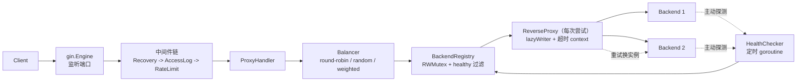

# 反向代理与负载均衡器 — 实施计划

> 技术栈：Go 1.26 + Gin + net/http/httputil.ReverseProxy
> 模块路径：`github.com/Sader-Lee/reverse-proxy`
> 配置格式：YAML
> 分支策略：每阶段一条特性分支，验收后 `git merge --no-ff` 合入 `main` 并打 tag

---

## 一、需求映射（题目 8 条硬性要求）

| 题号 | 要求                         | 实现落点                                                       |
| ---- | ---------------------------- | -------------------------------------------------------------- |
| 1    | 监听指定端口，接收客户端请求 | `cmd/proxy/main.go` + `gin.Engine`，`router.Any("/*path")`     |
| 2    | 按配置转发到多个后端实例     | `internal/proxy` + `internal/config`                           |
| 3    | ≥2 种负载均衡策略            | `internal/balancer`：轮询 / 随机 / 平滑加权轮询                |
| 4    | 健康检查，剔除并恢复实例     | `internal/health` + `internal/backend`                         |
| 5    | 请求超时、重试、访问日志     | `internal/proxy/retry.go` + `internal/middleware/accesslog.go` |
| 6    | CLI / 配置文件启动           | `internal/config`（YAML + flag 覆盖 + 校验）                   |
| 7    | 单元测试覆盖核心逻辑         | 各包 `*_test.go`，`go test ./... -race -cover`                 |
| 8    | 项目设计文档                 | `docs/design.md`                                               |

## 二、可选模块范围（已确认）

- 做：**限流**（令牌桶）、**Docker 部署**（Dockerfile + docker-compose.yml）
- 不做：Web 管理界面、HTTPS 终止

## 三、架构设计



### 关键设计决策

1. **转发内核用 `httputil.ReverseProxy`**，Gin 只承担路由与中间件职责。
   - Gin 的 `c.Writer` 已实现 `Hijacker` / `Flusher`，可支持 WebSocket 透传。
   - 需设置 `gin.Engine.UseRawPath = true`、`UnescapePathValues = false`，保留原始 URL 编码。
2. **重试决策点放在 `lazyWriter.WriteHeader`**（`ReverseProxy` 先写 header 再写 body）：
   - 传输层错误（尚未写任何响应字节）→ 换实例重试；
   - 后端返回可重试状态码（默认 502/503/504）→ 丢弃该响应，换实例重试；
   - 非幂等方法（POST/PATCH）默认**只**重试"连接失败"，不重试 5xx；
   - 每次重试通过 `Balancer.Next(exclude...)` 排除已失败实例，避免重复踩坑。
3. **健康检查双通道**：
   - 主动：定时 `GET {health_path}`，连续 N 次失败标记 DOWN，连续 M 次成功标记 UP（阈值防抖）；
   - 被动：转发失败即记账，达阈值直接剔除。
   - `Backend.alive` 使用 `atomic.Bool`，无锁读。
4. **依赖克制**：仅引入 `gin`、`gopkg.in/yaml.v3`、`golang.org/x/time/rate`。
   日志使用标准库 `log/slog`（JSON/Text handler），不引入 zap / viper。

## 四、目录结构

```
reverse-proxy/
├── cmd/proxy/main.go                 # 入口：解析配置 -> 装配 -> 启动 -> 优雅退出
├── internal/
│   ├── config/                       # YAML 解析 + 默认值 + 校验 + flag 覆盖
│   ├── backend/                      # Backend 模型、Registry、原子状态、统计计数
│   ├── balancer/                     # Balancer 接口 + roundrobin / random / weighted
│   ├── health/                       # 主动检查器 + 被动上报
│   ├── proxy/                        # Handler、lazyWriter、重试、超时、ReverseProxy 封装
│   └── middleware/                   # accesslog、ratelimit、recovery
├── configs/config.example.yaml
├── docs/
│   ├── plan.md                       # 本文件
│   └── design.md                     # 交付要求 8
├── test/e2e_test.go                  # httptest 多后端端到端测试
├── Dockerfile                        # 可选模块
├── docker-compose.yml                # 可选模块
├── Makefile
└── README.md
```

## 五、Git 工作流

- 主分支 `main`；每阶段一条特性分支，验收通过后 `git merge --no-ff`。
- 提交信息遵循 Conventional Commits：`feat(balancer): 支持平滑加权轮询`。
- **每个 commit 必须保证 `go build ./...` 通过**。
- tag 规划：`v0.1.0-scaffold` → `v0.2.0-mvp` → `v0.3.0-balancer` → `v0.4.0-health` → `v0.5.0-retry` → `v0.6.0-cli` → `v0.7.0-docs` → `v0.8.0-test` → `v0.9.0-ratelimit` → `v1.0.0`（Docker + 收尾）。
  说明：阶段 7（设计文档）提前到阶段 6（测试补全）之前执行——功能已全部就位，趁热写文档比重读代码更省事；
  阶段 8 拆为 8a（限流，已完成）与 8b（Docker）：8b 的构建文件已提供，但受本机拉取基础镜像速度限制（约 0.05 MB/s），未做实跑验证。

## 六、阶段计划

| #   | 阶段       | 分支                            | 交付物                                                           | 验收证据                                                               |
| --- | ---------- | ------------------------------- | ---------------------------------------------------------------- | ---------------------------------------------------------------------- |
| 0   | 骨架       | `chore/scaffold`                | `go mod init`、目录、`.gitignore`、`Makefile`、UTF-8 README      | `go build ./...` 通过                                                  |
| 1   | MVP 转发   | `feat/mvp-proxy`                | 单后端 `ReverseProxy` 透传 + 访问日志                            | 起后端 + 代理，`curl` 拿到后端内容，日志打印状态码与耗时               |
| 2   | 负载均衡   | `feat/balancer`                 | `Balancer` 接口 + 轮询/随机/平滑加权 + 单测                      | `go test ./internal/balancer/ -race`；3 个 httptest 后端验证分布比例   |
| 3   | 健康检查   | `feat/health-check`             | 主动探测 + 剔除 + 恢复 + 单测                                    | 杀掉后端 -> 日志 `mark DOWN` -> 流量全走存活节点；重启 -> `mark UP`    |
| 4   | 超时与重试 | `feat/retry-timeout`            | 每尝试超时、重试策略、lazyWriter + 单测                          | 慢后端验证超时；flaky 后端验证重试成功且客户端只收一个响应             |
| 5   | 最小 CLI   | `feat/config-cli`               | 仅 `-config` / `-check` / `-version` / `-listen`，不重复配置字段 | `-check` 能报出配置问题；`-version` 能区分构建                         |
| 6   | 测试补全   | `test/coverage`                 | 核心逻辑边界用例（负载均衡/健康检查/超时重试）                   | 三个核心包覆盖率 94.8%–98.3%；不给装配代码造测试                       |
| 7   | 设计文档   | `docs/design`                   | `docs/design.md`：架构、配置格式、转发流程时序图、健康检查机制   | 按文档从零启动一次成功                                                 |
| 8   | 可选模块   | `feat/ratelimit`、`feat/docker` | 8a 令牌桶限流；8b Dockerfile + docker-compose                    | 突发放行后 429 + `Retry-After`；`docker compose up` 一键起代理与多后端 |

### 每阶段固定收尾动作

1. `go build ./... && go vet ./... && go test ./... -race`
2. 跑一次真实端到端演示，留存终端输出证据
3. 更新 README 进度表
4. commit -> `git checkout main` -> `git merge --no-ff <branch>` -> `git tag`

## 七、配置格式草案

```yaml
listen: ":8080"

strategy: "weighted-round-robin" # round-robin | random | weighted-round-robin

backends:
  - url: "http://127.0.0.1:9001"
    weight: 3
  - url: "http://127.0.0.1:9002"
    weight: 1

health_check:
  enabled: true
  path: "/healthz"
  interval: "5s"
  timeout: "2s"
  failure_threshold: 3 # 连续失败 N 次标记 DOWN
  success_threshold: 2 # 连续成功 M 次标记 UP

retry:
  max_attempts: 3 # 含首次请求
  per_try_timeout: "3s"
  retry_on_status: [502, 503, 504]
  retry_non_idempotent: false

rate_limit:
  enabled: false
  rps: 1000
  burst: 200
  by: "ip" # ip | global

logging:
  level: "info" # debug | info | warn | error
  format: "json" # json | text
  access_log: true

admin:
  enabled: false
  listen: ":9000"

timeouts:
  read_header: "10s"
  write: "0s" # 0 = 不限制（支持流式/SSE）
  idle: "90s"
```

## 八、测试策略

| 测试对象      | 方法                                                              |
| ------------- | ----------------------------------------------------------------- |
| Balancer 策略 | 表驱动；随机策略注入固定 seed 的 `*rand.Rand` 保证可复现          |
| Registry 并发 | `-race` 下 N 个 goroutine 并发 `Next()` + 增删实例                |
| 健康检查      | 抽象 `Ticker`/时钟接口，用假时钟快进，避免真实 sleep              |
| 超时          | `httptest` 后端 `time.Sleep` 超过阈值，断言 504                   |
| 重试          | 前 N-1 次返回 503 / 直接 `panic` 断连，断言最终成功且请求计数正确 |
| 端到端        | `test/e2e_test.go` 起 3 个真实后端 + 真实代理，断言分发与剔除行为 |

## 九、风险与对策

| 风险                                        | 对策                                                              |
| ------------------------------------------- | ----------------------------------------------------------------- |
| Gin 与 `ReverseProxy` 组合时 URL 被二次解码 | 阶段 1 就用带 `%2F` 的路径做回归测试                              |
| 重试导致非幂等请求重复提交                  | 默认不重试非幂等方法的 5xx；`lazyWriter` 保证"响应未提交才能重试" |
| 流式响应（SSE）被超时掐断                   | 每尝试超时用 context 控制，写超时默认 0；客户端断开即 cancel      |
| 并发写 `Backend` 状态竞态                   | 状态用 `atomic`，Registry 用 `RWMutex`，全部测试跑 `-race`        |
